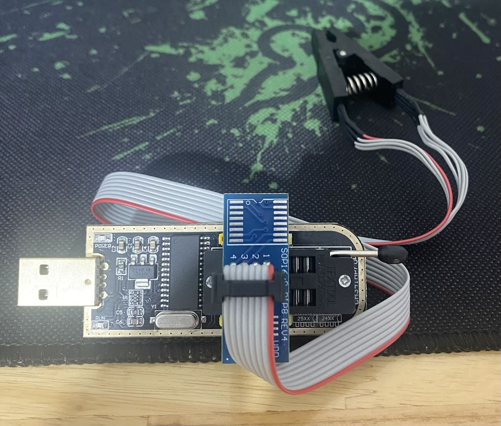
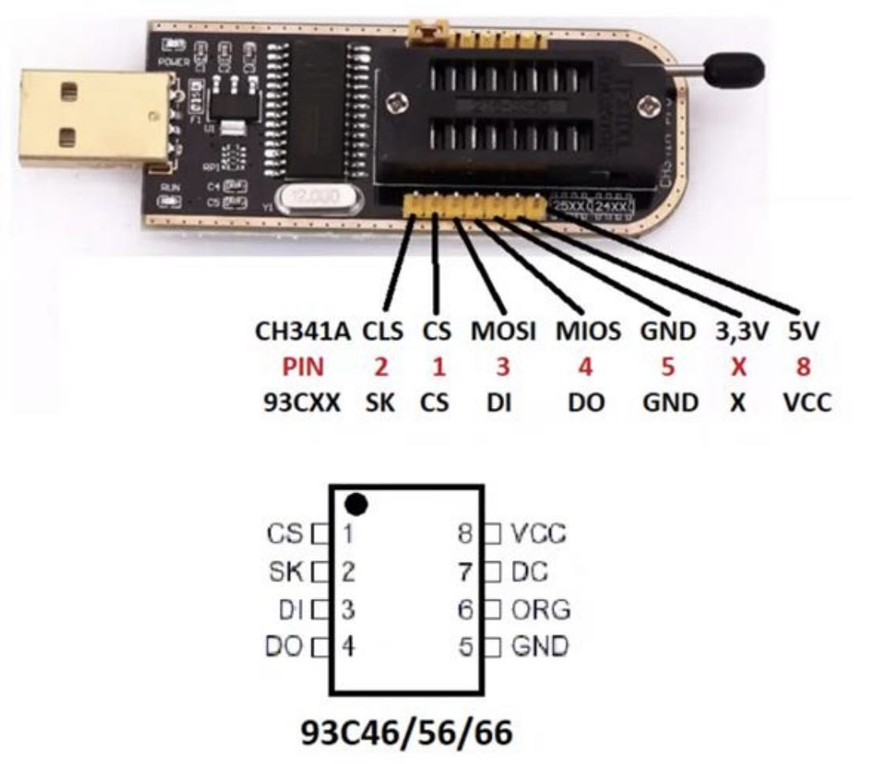

# aimbot-tools

A collection of tools and step-by-step notes for spoofing hardware identifiers (HWID) so that a machine presents fresh, unique fingerprints. Each hardware component is handled separately below, followed by a recommended end-to-end procedure.

## 1. Mainboard

The values that need to be changed are the **Serial number**, **UUID**, and **MAC Address** (if applicable — some boards using a Realtek NIC can have their MAC changed with the repository: https://github.com/dat58/rtnicpg).

Use the tool in `tools/random-bios-tuf-b460m`, run it with `cargo run` to generate a BIOS file (tailored for the **ASUS TUF B460M PLUS WIFI** mainboard).

Then use a **CH341A** programmer to flash the BIOS file into the mainboard's EEPROM with **NeoProgrammer** on Windows. Notes:

- Check the EEPROM chipset — it will be a 24- or 25-series chip.
- Plug pin 1 of the EEPROM into the **red** wire.
- If the chipset runs at **1.8V**, use a voltage step-down adapter to avoid damaging the chip.
- Select the correct chipset in NeoProgrammer. For example, the TUF-B460M board uses the **MX25L12872F [3.3V]** chip.
- Use `Read IC` to verify a stable connection, then open the BIOS file and start writing.
- Tick `Off-Protect`, `Erase`, `Blank Check`, `Write`, and `Verify`, then run `Write IC`.

**Do not interfere with the process until it completes.**



For chips that use a **3-wire serial** connection, convert it to **4-wire serial**:



## 2. Disk

Check the hardware version and use a tool that supports changing the disk serial number. Tools can be found at http://usbdev.ru/

## 3. Monitor

If you don't have a device such as a capture card that supports EDID overriding, you must open up the monitor and locate the EEPROM chip — it sits near the HDMI / DisplayPort connectors. Each video output port has its own EEPROM chip storing the EDID configuration for that port.

Use a **CH341A** to read the data from the EEPROM. The dump may contain a lot of information, and inside it there is an EDID block that starts with `00 FF FF FF FF FF FF 00` and is 128 / 256 / 384 bytes long. Use a tool such as **AW EDID Editor** to change the serial number and save the new EDID, then overwrite the old EDID region and use the CH341A to flash it back into the EEPROM.

Once done, you can check the monitor serial number from PowerShell:

```powershell
Get-WmiObject WmiMonitorID -Namespace root\wmi |
Select-Object @{l="Manufacturer";e={[System.Text.Encoding]::ASCII.GetString($_.ManufacturerName)}},
@{l="Model";e={[System.Text.Encoding]::ASCII.GetString($_.UserFriendlyName)}},
@{l="SerialNumber";e={[System.Text.Encoding]::ASCII.GetString($_.SerialNumberID)}}
```

## 4. GPU

There is no way to change the GPU UUID because the seed is written into the dice chip. If you use an **NVIDIA** GPU, you're out of luck. However, for **AMD** cards you can use the **GFX8 family or older**, which have no UUID — the UUID only exists starting from GFX9.

## 5. Keyboard + Mouse + Headphone

Prefer models that have no serial number.

## 6. RAM

Choose RAM from vendors that do not use serial numbers, such as **Corsair**.

---

## Recommended procedure

1. **Spoof the mainboard.**

2. **Spoof the disk and restore the Windows ghost image** (you can use **Macrium Reflect**).

   If you need to reset Windows to a fresh-install state while keeping all the drivers from the ghost image, open CMD as Administrator and run:

   ```cmd
   C:\Windows\System32\Sysprep\sysprep.exe /generalize /oobe /reboot
   ```

   Remove old user accounts — replace `USERNAME` with the account you want to delete:

   ```cmd
   net user USERNAME /delete
   rd /s /q "C:\Users\USERNAME"
   ```

3. **Spoof the monitor.**

   With an **Elgato 4K X** capture card, open **Elgato 4K Capture Utility** as Administrator, go to device settings and choose **Reset default**. Reopen the capture utility, go to the device section, select **custom EDID**, and apply. Reopen the utility again and set the mode to **Internal**. From this point the EDID has been changed.

4. **Spoof the TPM.**

   Prepare a bootable Ubuntu USB stick (used to install the OS) and keep it plugged into the PC.

   In Windows, press `Windows + R`, type `tpm.msc`, then click **Clear TPM** and confirm the reset. As soon as the machine restarts, immediately boot into Ubuntu from the USB, open a terminal, and run:

   ```bash
   sudo su
   bash reset_tpm2.sh
   reboot
   ```

   Remove the USB, press Enter, and wait for Windows to boot. Verify all the serials in Windows by right-clicking **serialChecker.bat** and running it as Administrator, then pressing **1** and Enter.

5. **Restart Windows and enter the BIOS menu.**

   - Go to **Boot → Secure Boot → Manage Keys → Clear Secure Boot Keys → Install default Secure Boot keys**.
   - Go to **Advanced** and **disable Wi-Fi** and **disable the Bluetooth device**.
   - Save and exit.

6. **Right-click the Windows icon → Device Manager → View → Show hidden devices → Uninstall all hidden devices.**

7. **Install the game and restart the machine.**

Congratulations!
